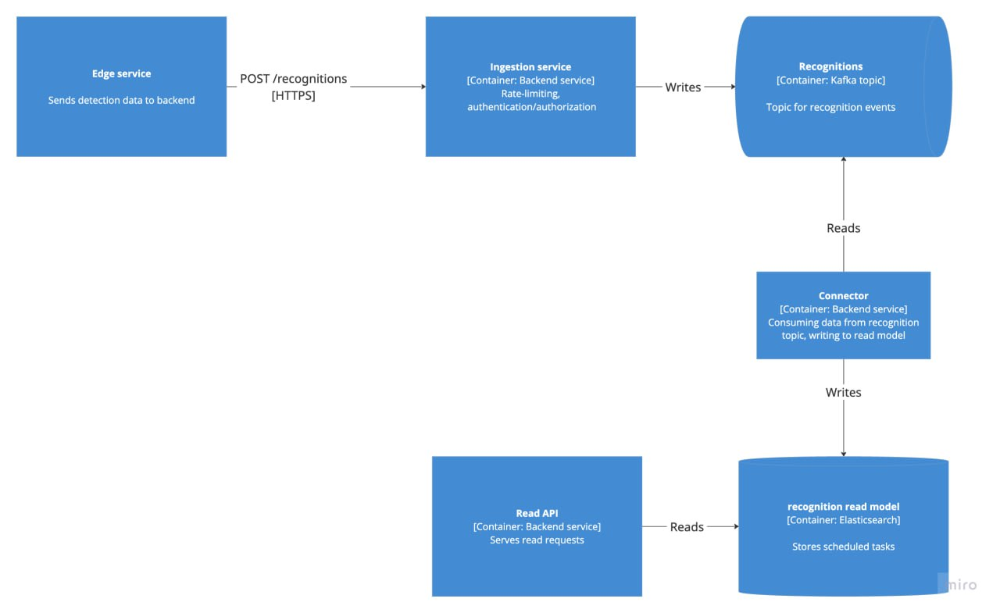

# Recognition Pipeline - System Design Overview

This document outlines the system design of a real-time recognition pipeline for ingesting, processing, and querying object recognition events sent from edge devices. Each stage is broken down to address its responsibilities, scalability, reliability, and performance characteristics.

---



## Step 1: Data Ingestion (Edge → API → Kafka)

### 1.1 HTTP API - Receive Recognition Events

Edge services send detection events via an HTTP POST API in **batches**.

#### Endpoint
```http
POST /recognitions
```

#### Payload Format
```json
{
  "batch": [
    {
      "timestamp": 1672531199000,
      "source": "device-1",
      "uniqueId": "uuid-123",
      "lat": 52.2297,
      "lon": 21.0122,
      "type": "car",
      "confidence": 0.95
    }
  ]
}
```

#### Scalability
- Supports horizontal scaling via multiple API instances.
- Batching reduces HTTP overhead and improves throughput.

#### Reliability
- Secure communication using HTTPS.
- Rate limiting per IP to prevent abuse.
- Optional enforcement at API Gateway level.

---

### 1.2 Ingestion Service - Processing and Dispatch

The ingestion layer performs validation, auth, and pushes data to Kafka.

#### Design Notes
- Use non-blocking/reactive frameworks (e.g., Spring WebFlux).
- Stateless architecture for easy scaling.
- Validate and transform each record in batch.

#### Scalability
- Horizontal scalability via container replicas.
- Kafka producer tuning:
  - `acks=0` or `1` for speed
  - `batch.size`, `linger.ms`, and `compression.type=snappy`

#### Reliability
- tweak acks/min-in-sync-replicas, additional reliability by more instances of the application

---

## Step 2: Core Event Stream - Kafka Recognitions Topic

Kafka acts as the central event bus and system of record for all recognition events.

#### Configuration
- Avro schema for compact binary serialization.
- Log compaction enabled, infinite retention.

#### Scalability
- Add partitions to parallelize ingestion.
- Scale horizontally with additional brokers.

#### Reliability
- increase replication factor
- Durable, append-only log structure.

#### Storage Estimate
- 2.5B events/month × ~100 bytes → ~250 GB/month raw.
- ~150–200 GB/month with compression.

---

## Step 3: Read Model Population (Kafka → Elasticsearch)

### 3.1 Connector (the part I've implemented. Implementation contains - reading from kafka topic, writing into elastic read model with e2e test using testcontainer)   

Connector reads from the `recognitions` topic and writes to the Elasticsearch read model. Essentially can be 

Avro Schema Definition
```json
{
  "type": "record",
  "name": "RecognitionEvent",
  "namespace": "com.example.recognition",
  "fields": [
    {"name": "timestamp", "type": "long"},
    {"name": "source", "type": "string"},
    {"name": "uniqueId", "type": "string"},
    {"name": "lat", "type": "double"},
    {"name": "lon", "type": "double"},
    {"name": "type", "type": "string"},
    {"name": "confidence", "type": "float"}
  ]
}
```

Topic key: uniqueId

#### Implementation
- Use Custom or Elasticsearch Sink Connector.
- Tasks/Instances scale with number of partitions.

#### Scalability
- Connector instances/tasks scale independently.
- Sink throughput matches partition parallelism.

---

### 3.2 Elasticsearch Read Model

Stores denormalized event data for fast search, filtering.

#### Mapping
```json
{
  "mappings": {
    "properties": {
      "timestamp": { "type": "date" },
      "source": { "type": "keyword" },
      "uniqueId": { "type": "keyword" },
      "location": { "type": "geo_point" },
      "type": { "type": "keyword" },
      "confidence": { "type": "float" }
    }
  }
}
```

#### Trade-off
- Having separate read model is compromising for eventual consistency. Data in read-model is eventually-consistent with master data in recognition topic. 
#### Write Scaling
- Multiple primary shards for parallel indexing.
- Distribute shards across Elasticsearch nodes.

#### Storage Optimization
- Use `keyword` for structured fields.
- Disable:
  - `_all` (deprecated)
  - `_source` if full docs not needed
  - `doc_values` on non-aggregated fields
- Enable LZ4 or ZSTD compression.

#### Reliability
- Replication and snapshotting enabled.
---

## Step 4: Read API (Client Access Layer)

Serves queries against Elasticsearch for UIs, dashboards, or external systems. 

#### Query Features
- Filter by:
  - `timestamp` (time range)
  - `type` (term)
  - `location` (geo bounding box or distance)
  - `confidence` threshold
- Use `search_after` with sorting for efficient pagination.

#### Scalability
- Stateless API layer → easy to horizontally scale.
- Backed by replicated Elasticsearch nodes.

---

## Extensibility - New Read Models

Kafka enables easy plug-and-play for new read models without touching upstream services:

- PostgreSQL (relational views)
- ClickHouse / BigQuery (analytics)
- InfluxDB (time series)
- ML pipelines (feature extraction, enrichment)

---

## Final Summary

| Layer            | Scales Via                      | Reliability Features                   |
|------------------|----------------------------------|----------------------------------------|
| HTTP API         | Horizontal service scaling       | HTTPS, rate limiting                   |
| Ingestion Service| Stateless containers             | Retry + validation                     |
| Kafka Topic      | Partitions, brokers              | Replication, compaction, replayable    |
| Sink Connector   | Tasks per partition              | Reprocessing from topic                |
| Elasticsearch    | Shards + replicas                | Snapshots, compression, alerting       |
| Read API         | Stateless HTTP nodes             | Backed by replicated Elastic cluster   |

This design is optimized for high-throughput, scalable ingestion, and fast geospatial and time-series querying, with durability and extensibility built-in at every tier.
